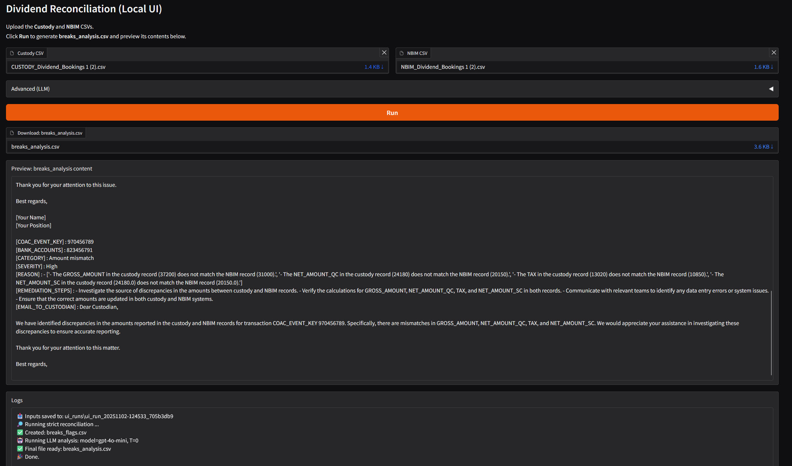
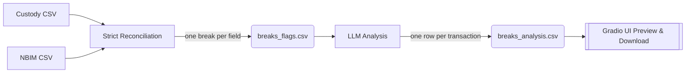

# LLM‑Powered Dividend Reconciliation (NBIM Case)

> End-to-end prototype that detects, classifies, and explains dividend reconciliation breaks between **Custody** and **NBIM** data, featuring a local Gradio UI and an optional LLM analysis step.



---

## TL;DR

1. **Strict compare** Custody vs NBIM to produce a long-form `breaks_flags.csv` (one break per row).  
2. **LLM analysis** turns those flags into human-friendly diagnostics + remediation in `breaks_analysis.csv` (one transaction per row).  
3. **Local UI**: upload two CSVs and download results; works offline for the strict step, and uses your OpenAI key for the LLM step.

---

## Repo Contents

```text
.
├── NBIM_app.py                    # Gradio UI (run locally)
├── strict_breaks_reconciliation.py# Deterministic “strict” comparator
├── nbim_llm_breaks.py             # LLM-based classification & remediation
├── llm_playbook.txt               # Domain playbook injected into prompts
├── requirements.txt               # Python deps
├── data/                          # (optional) place your CSVs here
└── images/
    └── UI.png #the screenshot above
```

The case background and deliverables are described in `Technology and Operations test_case_*.docx` included with the materials.

---

## Features

- **Deterministic break detection** with domain-aware normalization (date/currency/number tolerance).
- **LLM explanations**: category, severity, reason bullets, remediation steps, and optional custodian email draft.
- **Simple local UI** to run the whole flow without touching the terminal.
- **Works offline** for strict comparison; the LLM step is optional.

---

## How It Works



- **Strict step** (`strict_breaks_reconciliation.py`):  
  Outer-joins on `(COAC_EVENT_KEY, BANK_ACCOUNTS)` and compares mapped business fields with normalized equality
  (dates → `YYYY-MM-DD`, currencies → upper-case, numbers → float with small tolerance). Emits **long format** flags
  with `BREAK_TYPE` ∈ {`mismatch`, `missing_at_custody`, `missing_at_nbim`}.

- **LLM step** (`nbim_llm_breaks.py`):  
  Groups flags per transaction and asks an LLM to return strict JSON: `reason` (bulleted), `category` (from a fixed set),
  `severity`, `remediation_steps`, and optional `email_to_custodian`. The **Playbook** in `llm_playbook.txt` is injected
  to keep guidance consistent.

- **Local UI** (`NBIM_app.py`):  
  Single-page app to upload two CSVs, run the pipeline, and download `breaks_analysis.csv`. The LLM step only runs if
  `OPENAI_API_KEY` is present; otherwise the UI completes the strict step and notes that LLM was skipped.

---

## Installation

> Python **3.10+** recommended.

```bash
python -m venv .venv
source .venv/bin/activate   # Windows: .venv\Scripts\activate
pip install -r requirements.txt
```

Update the `OPENAI_API_KEY` to your one in the `.env` file in the project root to enable the LLM step:

```env
OPENAI_API_KEY=sk-...
```

---

## Running the App (Recommended)

```bash
python NBIM_app.py
```

Then open the local URL shown in the console (defaults to `http://127.0.0.1:7860`) and:

1. **Upload** your Custody and NBIM CSVs.  
2. Click **Run**.  
3. **Download** `breaks_analysis.csv` and review the **Preview** pane.

**Note:** If no API key is set, the app still produces `breaks_flags.csv` and a minimal `breaks_analysis.csv` without LLM commentary.

---

## Programmatic Use

```python
from pathlib import Path
from strict_breaks_reconciliation import reconcile_breaks
from nbim_llm_breaks import run_llm_break_analysis

breaks_csv = Path("breaks_flags.csv")

# 1) strict compare (offline)
reconcile_breaks(
    custody_csv=Path("data/CUSTODY_Dividend_Bookings.csv"),
    nbim_csv=Path("data/NBIM_Dividend_Bookings.csv"),
    out_csv=breaks_csv
)  # -> breaks_flags.csv

# 2) LLM analysis (requires OPENAI_API_KEY)
run_llm_break_analysis(
    breaks_flags_path=str(breaks_csv),
    out_csv="breaks_analysis.csv",
    model="gpt-4o-mini",
    temperature=0.0
)  # -> breaks_analysis.csv
```

---

## Data Contract (Column Mapping)

Business field mapping used for comparison (example subset):

| Business          | Custody column            | NBIM column                |
|-------------------|---------------------------|----------------------------|
| COAC_EVENT_KEY    | COAC_EVENT_KEY            | COAC_EVENT_KEY             |
| BANK_ACCOUNTS     | BANK_ACCOUNTS             | BANK_ACCOUNT               |
| EX_DATE           | EX_DATE                   | EXDATE                     |
| PAY_DATE          | PAY_DATE                  | PAYMENT_DATE               |
| CURRENCIES        | CURRENCIES                | QUOTATION_CURRENCY         |
| DIV_RATE          | DIV_RATE                  | DIVIDENDS_PER_SHARE        |
| TAX_RATE          | TAX_RATE                  | WTHTAX_RATE                |
| GROSS_AMOUNT      | GROSS_AMOUNT              | GROSS_AMOUNT_QUOTATION     |
| NET_AMOUNT_QC     | NET_AMOUNT_QC             | NET_AMOUNT_QUOTATION       |
| TAX               | TAX                       | WTHTAX_COST_QUOTATION      |
| NET_AMOUNT_SC     | NET_AMOUNT_SC             | NET_AMOUNT_SETTLEMENT      |
| SETTLED_CURRENCY  | SETTLED_CURRENCY          | SETTLEMENT_CURRENCY        |

---

## Outputs

- **`breaks_flags.csv`** — long format, one row per field-level break:  
  `COAC_EVENT_KEY, BANK_ACCOUNTS, BREAK_TYPE, COLUMN, CUSTODY_VALUE, NBIM_VALUE`

- **`breaks_analysis.csv`** — one row per transaction (after LLM step):  
  `CATEGORY, SEVERITY, REASON (bulleted), REMEDIATION_STEPS (bulleted), EMAIL_TO_CUSTODIAN`

---

## Prompting & Guardrails (LLM Step)

- System prompt frames the model as a **senior operations analyst for equity dividends**.
- The **Playbook** provides actionable tips (rounding, FX, WHT, record/ex dates, settlement currency).
- Fixed taxonomy for `category` and `severity` + temperature `0.0` for determinism.
- The strict comparator remains the source of truth; LLM cannot force-match records.

---

## Troubleshooting

- **No LLM output** → set `OPENAI_API_KEY` in `.env` or your shell env.  
- **CSV parse issues** → ensure clean separators (`, ; | \t`) and UTF‑8/CP‑1252 encodings.  
- **Dependency issues** → update `pip` and re-run `pip install -r requirements.txt`.

---

## Roadmap

- Pass full-row context into LLM from the UI for richer diagnostics.
- Add multi‑tranche event handling and ADR fee logic in the strict step.
- Optional agentic workflow (auto-open tickets, custodian email drafts → Outbox queue).

---

## License

Proprietary / for NBIM case evaluation.